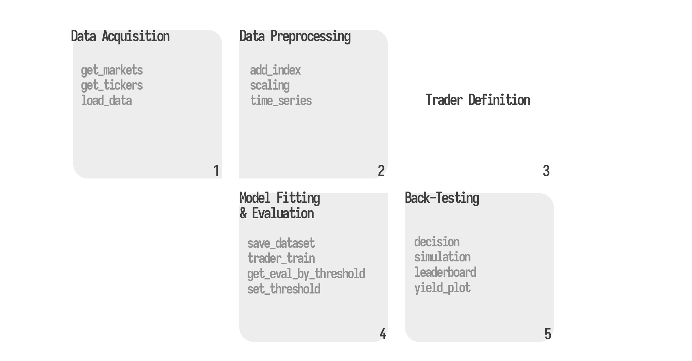
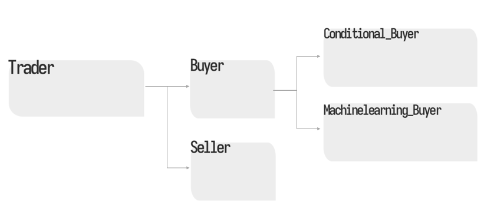
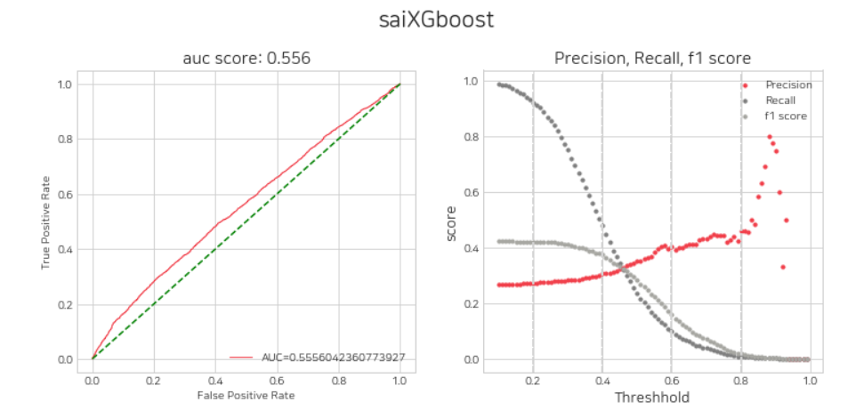
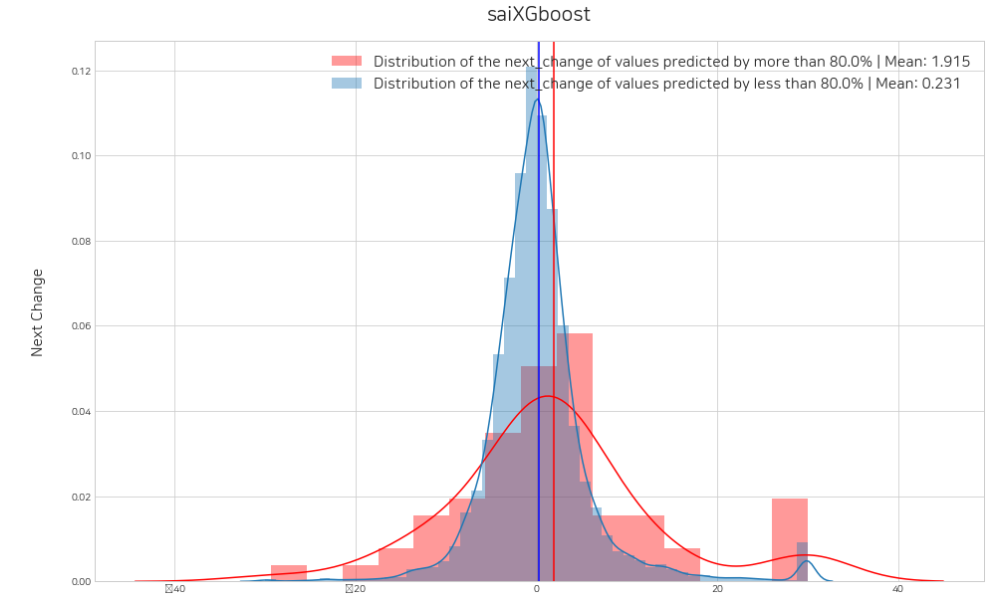
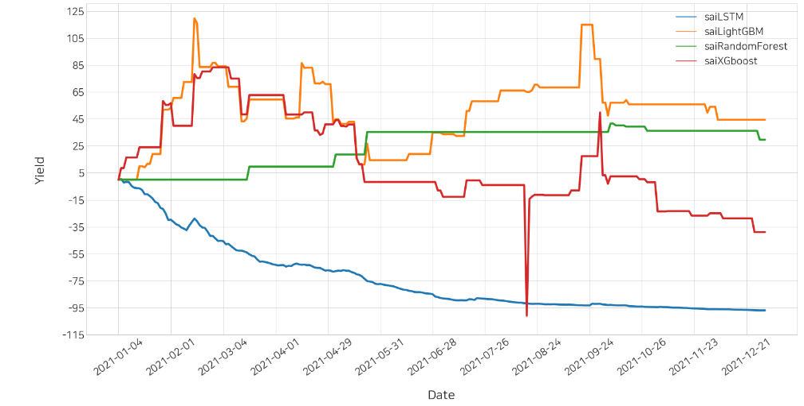

<p align="center">
      
 </p>


------
## stockait: python machine learning framework for stock prediction
stockait is an integrated machine learning package for technical research of stock price big data. From data collection to machine learning-specific stock price time series dataset generation, AI model learning and model evaluation, and backtesting, the goal of this package is to provide a one-time Python library to enhance the utilization and convenience of stock price big data technical research.

<br>
<br>


------
## Why stockait? 
- **Stock Price Big Data Collection** 

 'stockait' stores big data in github and provides it to users. Because 'stockAit' is a research package, the data provided here focused on collecting data, storing it reliably, and storing it in a high-quality way, rather than collecting it in real time with unstable crawling methods.

- **An integrated package that enables the entire process of machine learning** 

 In the past, we had to use distributed libraries to study stock price big data. Stockait is very useful because it is an integrated package that can collect data, preprocess data, learn artificial intelligence models, evaluate models, and backtest (yield calculation) at once.

- **Support the convenience of stock price big data research** 

 The stockait package can also be used by experts with domain knowledge of stocks. When these experts are unfamiliar with programming and want to perform artificial intelligence technological analysis with stock price data, it helps them conveniently conduct research on stock price data without a large amount of programming.

<br>
<br>


------
## Datasets provided
The following is a description of the dataset provided by stockait, the dependent variable that are set by default.

▪️ Dataset
- Dataset is a daily stock price dataset that provides open, high, low, close, and volume columns by default.

▪️ Dependent variable
- `Dependent variable`: The `add_index` function creates a dependent variable `next_change` column, which stockait recognizes as a dependent variable by default. `next_change` means the rate of change in the closing price of the next day.


<br>
<br>


------
## Installation
```python
pip install stockait
```

```python
import stockait as sai 
```


<br>
<br>

------
## How to use stockait? 
You can find more information about using stockait in the `tutorials` folder.


### ▪️ method 
The following image summarizes the methods of stockait.  




Specific methods are as follows.

### 1. Data Acquisition 

**1.1 Bringing up the market**
```python
sai.get_markets(country:list)
```

**1.2 Bringing up tickers**
```python
sai.get_tickers(markets:list, date:string)
```

**1.3 Bring up stock price data**
```python
sai.load_data(date:list, tickers:list=None)
```

<br>

### 2. Data Preprocessing

**2.1 Add Secondary Indicators** 
```python
sai.add_index(data:pd.DataFrame(), index_list:list)
```

**2.2 Scaling**
```python
sai.scaling(data:pd.DataFrame(), scaler_type:String, window_size:Int=None)
```

**2.3 Convert to time series data**
```python
sai.time_series(data:pd.DataFrame(), day:Int=10)
```
<br>


### 3. Trader Definition
**3.1 trader definitions**

For trader definitions, it is recommended to refer to the `tutorials` folder. 

<br>

### 4. Trader(Model) Fitting & Evaluation 
**3.2 Store required data sets inside the trader**
```python
sai.save_dataset(lst_trader:list, train_data:pd.DataFrame(), test_data:pd.DataFrame(), train_data_scaled:pd.DataFrame()=None, test_data_scaled:pd.DataFrame()=None)

```

<br>

**3.3 Model fitting**
```python
sai.trader_train(lst_trader:list)
```

**3.4 Model evaluation** 
```python
sai.get_eval_by_threshold(lst_trader)
```


**3.5 Setting Thresholds**
```python
sai.set_threshold(lst_trader, lst_threshold:list, hisogram:bool=True)
```



<br>

### 4. Back Testing  
**4.1 Making a sales log**
```python
sai.decision(lst_trader:list, dtype='test', data=None, data_scaled=None)
```

**4.2 Calculate the yield**
```python
sai.simulation(df_signal_all, init_budget, init_stock)
```

**4.3 Leader Board**
```python
sai.leaderboard(df)
```

**4.4 Visualize yield** 
```python
sai.yield_plot(df)
```

