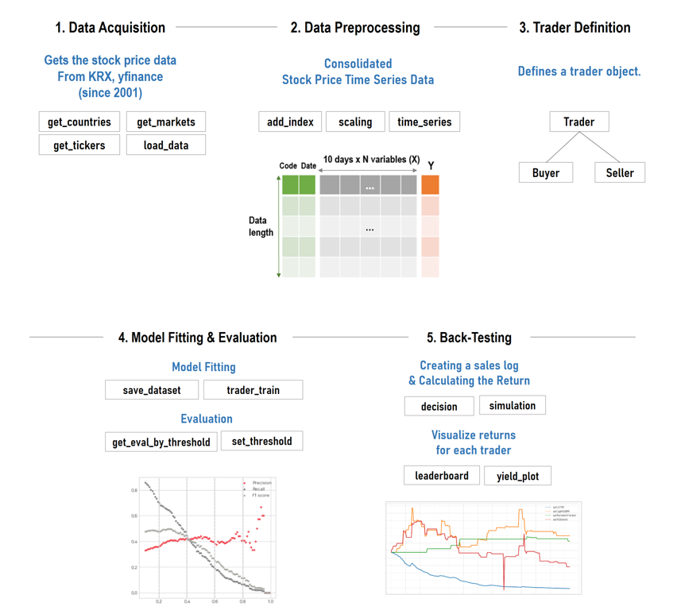
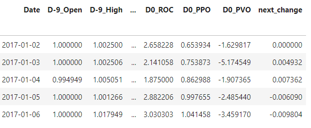
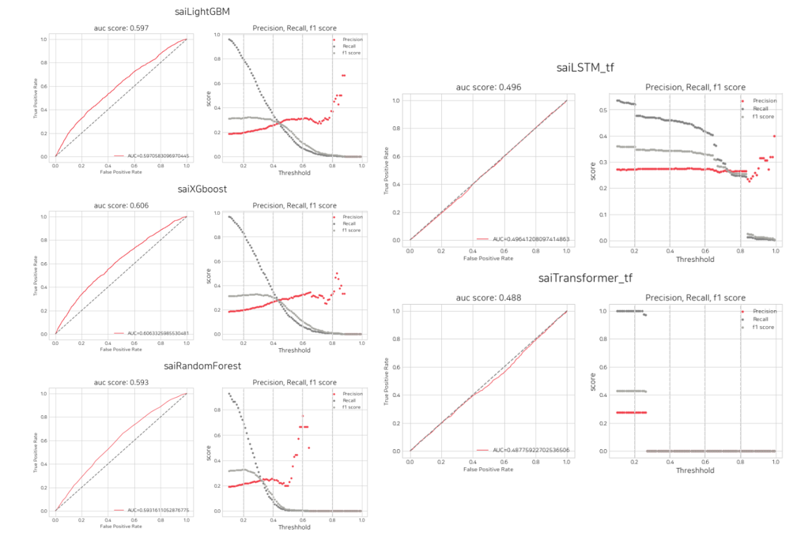
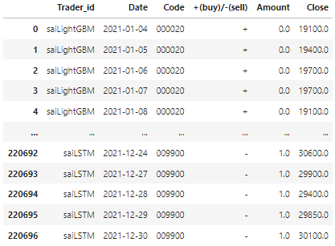
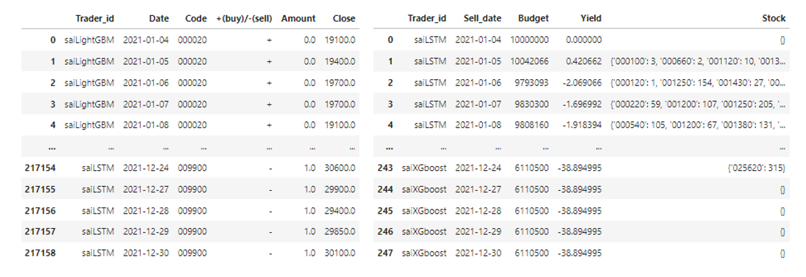
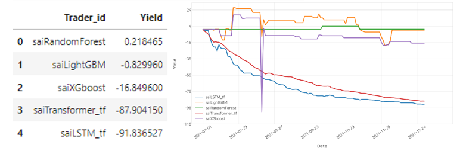

# Summary

Stock price data is a large-scale representative time series big data that includes price fluctuations spanning several decades for thousands of stocks, not only in the financial sector but also in other fields, making it challenging to find. Attempts to discover specific patterns in price fluctuations over the past several decades have continuously persisted, leading to the development of various technical indicators to explain these price movements. Recently, there has been growing attention towards using machine learning for artificial intelligence-based learning from big data to identify patterns. We offer the Python integrated package 'stockAIT' to make it easier to add these technical indicators and perform machine learning-based predictions. 'stockAIT' provides a unified library that can handle everything from creating machine learning-specific stock time series datasets to artificial intelligence modeling, model evaluation, and backtesting. This aims to enhance the convenience and accessibility of stock price data research, catering to financial experts, individuals unfamiliar with programming, and researchers focusing on model development.

# State of need 

Stock price data is a large-scale representative time series big data that includes price fluctuations spanning several decades for thousands of stocks. Due to its scale, which is difficult to find not only in the financial sector but also in other fields, stock price data is a crucial resource in the field of time series analysis. Attempts to identify specific patterns in stock price fluctuations over the past several decades have continuously persisted (e.g. Elliott Wave Theory[@es4]), and various technical indicators have been developed to explain these price movements such as MACD[@es5], CCI[@es6], and RSI[@es7]. Recently, A study that used machine learning on historical stock data to offer a method for technical analysis of pattern-based stock prediction to generate promising prediction[@es2], research that combines technical indicators and machine learning in the field of technical analysis of stock price data, such as predicting the next day's stock price increase using price vectors of dates, has been actively attempted and gained attention[@es3]. However, to conduct such machine learning-based price prediction analysis, it has been necessary to program a series of tasks, including data collection, preprocessing, adding technical indicators, modeling, visualization, and backtesting, or to utilize various separately developed libraries. Consequently, individuals lacking expertise in programming, including financial experts and the general public, have found it challenging to experiment with their own ideas for price prediction models. StockAIT addresses these issues and satisfies two specific requirements.

First, 'StockAIT' provides convenience for research on stock big data. In traditional methods of conducting research on stock data, various libraries are typically used for different functions. For instance, data collection might involve libraries like 'Finance Data Reader' and 'yfinance'[@yj1], data preprocessing may require 'NumPy' and 'Pandas,' while modeling may involve 'scikit-learn'[@yj2], 'TensorFlow[@paper1],' 'PyTorch[@paper2],' and so on. However, by using 'StockAIT,' researchers can perform data collection, preprocessing, modeling, and backtesting all within a single package, thereby enhancing the convenience of their research.

Second, 'StockAIT' offers concise code. Functions provided by 'StockAIT' can be used to perform tasks such as stock data collection, adding technical indicators, data preprocessing like scaling, defining trading strategies, and simulating returns using concise code. This code's simplicity allows even those not proficient in programming, including financial experts, to conduct research with ease, maximizing efficiency.

# Implementation and use in research 

‘stockAIT’ is designed to facilitate stock big data analysis research through methods such as load_data, add_index, and the Trader class, with the workflow illustrated in [Figure 1].

When you input a desired Market list into the load_data method, a consolidated stock price dataset is provided, organized by stock code and date, with Open, High, Low, Close, and Volume data. 'stockAIT' fetches publicly available stock data from the KRX website for South Korean stock data and uses data provided by 'yfinance' for stock data from other countries. As of the current reference date, data is available from January 1, 2001, to December 31, 2022, and it is updated annually, providing Open, High, Low, Close, and Volume data.

Stock price prediction is a challenging task, as it can be influenced by various factors such as political events, global economics, financial reports, and corporate performance[@ej1]. To address this challenge, numerous studies are being conducted using various soft computing technologies and algorithms, employing technical or fundamental analysis to predict stock market behavior[@ej2]. 'stockAIT' specializes in providing pre-processing methods for technical analysis within this context. The add_index method allows easy addition of technical indicator columns from the Open, High, Low, Close, and Volume data of the consolidated stock price dataset. Additionally, for scaling, there are methods such as MinMax, Standard, Robust, and DivClose, which standardize price-related variables by dividing them by the previous day's closing price, to adjust for different scales among different stocks. The time_series method transforms daily data into a time series dataset by reorganizing data from the current day (D0) to N days back (DN-1).

By applying all three preprocessing steps, you can obtain the consolidated stock time series dataset [Figure 2].

Once the dataset preparation is complete, you proceed to define the Trader. With Trader objects, you can conduct model training and evaluation, as well as simulate profits through buying and selling transactions.

Firstly, to train the model, you divide the data into training, validation, and test datasets, and then save the data within the Trader using the save_dataset method. Next, you define Buyer and Seller objects within the Trader. The Buyer objects include ConditionalBuyer, which decides purchases based on specific data conditions, and MachinelearningBuyer, which determines purchases based on machine learning model predictions. The Seller object includes SubSeller, which sells all purchased stocks the following day.

In the experiments, the training data spans from January 1, 2017, to December 31, 2020. The validation dataset, used for model evaluation, ranges from January 1, 2021, to June 31, 2021. The test dataset, used for backtesting, covers the period from July 1, 2021, to December 31, 2021. Various models such as LightGBM[@paper3], XGBoost[@paper4], RandomForest[@paper5], LSTM[@paper6], and Transformer[@paper7] were employed. When defining the models, packages like scikit-learn, xgboost, and lightgbm were used, while for deep learning models, both Keras and PyTorch frameworks are applicable.

The trader_train function is utilized to conduct model training, and after training, you can evaluate the model's performance through the get_eval_by_threshold function, which supports visualizing metrics like AUC score and Precision, Recall, F1-score for various threshold values [Figure 2]. To make decisions in stock trading, you can assess the Precision metric on the right graph, determining the optimal prediction probability threshold where the model's success rate is higher.

After reviewing [Figure 3] graphs and making decisions regarding the threshold values, you can store these thresholds in a list in the order of the traders. Then, you can input this list of thresholds into the lst_threshold argument of the set_threshold function. This allows you to perform profitability validation through a histogram graph of the next day's closing price change rate [Figure 4]. The thresholds you input are automatically saved within the machinelearning_buyer objects of each trader.

[Figure 4] Graph comparing the rate of change at the closing price of the next day based on threshold

The decision function automatically determines buy and sell decisions based on the specified thresholds. Once the trading journal for all traders is completed, it is returned as a single DataFrame. The trading journal DataFrame consists of buy (+) and sell (-) states, buy/sell ratios, and Close information.

The simulation function calculates returns based on the generated trading journal. The leaderboard function provides a total return for each trader, allowing you to assess their performance individually. The yield_plot function offers the advantage of visualizing daily returns, enabling a quick overview of the model's performance. This encompasses the backtesting process of validating one's algorithms and investment strategies using historical data.

## References
