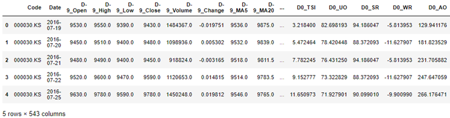
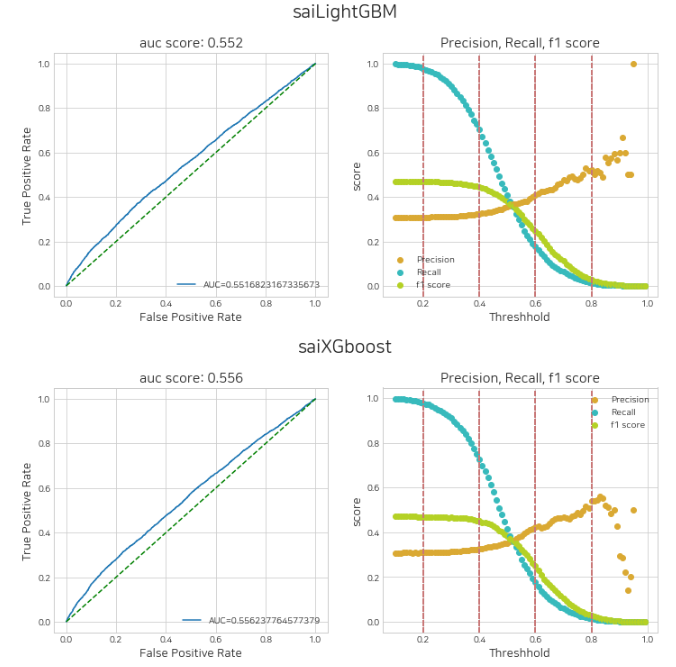
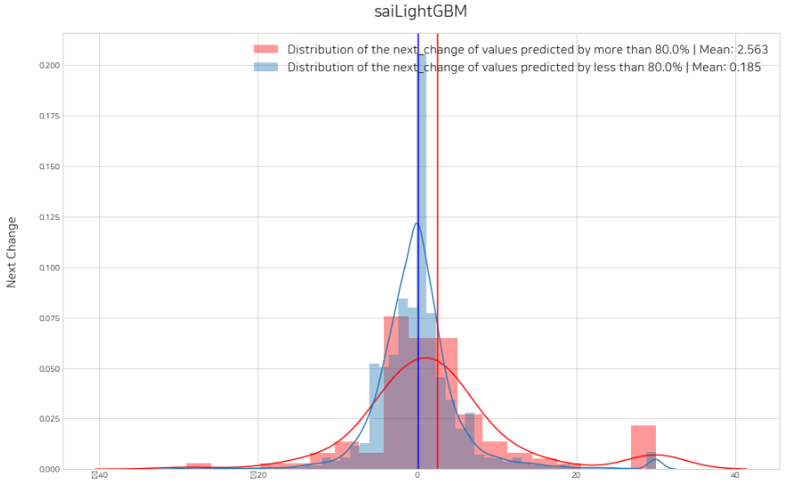
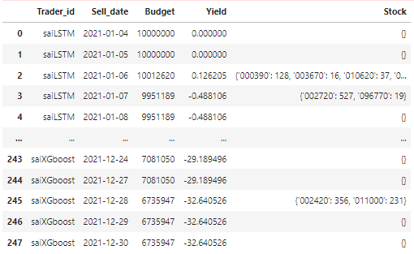
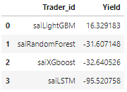
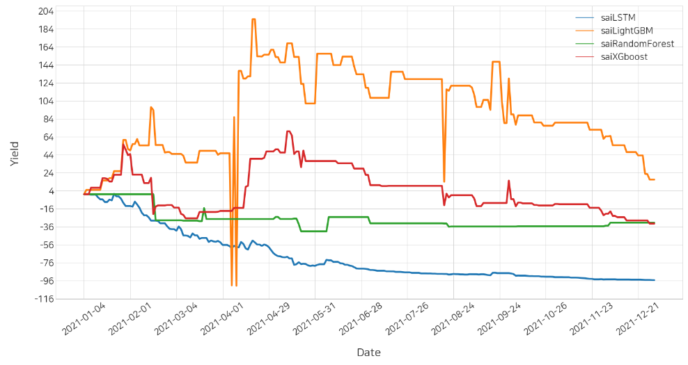

# Summary

This paper is a record of research on predicting the closing price by learning rise and fall patterns with statistical big data. Stock data is time-series data in the field of meat that has important value for studying price changes over a long period of time. A study that used machine learning on historical stock data to offer  a  method for technical analysis of pattern-based stock prediction to generate promising prediction[@es2], As a technical analysis of stock price data, active research is being conducted recently, such as a study that predicts whether or not the stock price will rise the next day through the price vector of the days [@es3], the use of machine learning techniques in combination with technical analysis indicators is receiving more and more attention[@es1]. We present “stockAIT”, a Python integration package for learning and research, for convenient use of such technical analysis. stockAIT provides an integrated library that enables the creation of stock price time series datasets specialized for machine learning, artificial intelligence modeling and model evaluation. Through this, the goal of this study is to increase the usability and convenience of big data research on stock prices. As a result of performing backtesting of example studies using our library and visualizing return results, XGboost, LogisticRegression, and LightGBM models showed an upward trend, yielding significant results in predicting stock prices.

# State of need 

'stockAIT' is a Python library which is better than the existing library used to make models predicting stocks. First of all, existing libraries are inconvenient to use because their functions are distributed to different libraries. For example, we have used 'fdreader', 'yfinance' [@yj1] for data loading, 'pandas' for data preprocessing, and 'sklearn' [@yj2]', 'keras' and 'pytorch' for modeling. By modularizing the functions of data collection, preprocessing, and modeling, 'stockAIT' can easily conduct stock price prediction research even for those who are not good at programming. In addition, there were no libraries required to validate the performance of the model before. Validation is an essential process for ensuring the reliability of the model. The 'stockAIT' model validation function makes it easy to draw back-testing results and yield graphs. This allows you to evaluate the performance of learned models using future data and view the results at a glance. Finally, stock price data requires a lot of time and money for enough open source or quality data.[@yj3] From Github, Users of 'stockAIT' can download 10 years worth of stock price data collected from 'KRX' and 'Yahoo Finance'.

# Implementation and use in research 

sai uses yfinance's Download for overseas stock data to provide stock data, and domestic (Korea) stock data crawls the public stock data on the KRX website, and from January 1, 2001 to December 31, 2022. Open, High, Low, Close, Volume data are obtained. When inputting the desired Market list in read_data method, an integrated stock price dataset consisting of codes and dates open, High, Low, Close, and Volume is provided.
Predicting stock prices is a challenging task as it depends on various factors including but not limited to political conditions, global economy, company’s financial reports and performance etc.[@ej1] To address this, numerous studies have been conducted on the stock-market prediction using technical or fundamental analysis through various soft-computing techniques and algorithms.[@ej2] add_index method can easily add technical aid columns from Open, High, Low, Close, and Volume of the Integrated Dataset. In addition, the scaling method for different scales for each item has a divclose that divides minmax, standard, robust and price -related variables into the closing price of the previous day. time_series method reconstructs the data into N-day by the day (DN-1) compared to the day (D0) and converts it into a time series dataset.

Before using the Trader class, the user must split the Train/Test dataset and declare the model to be used by the buyer. The Trader class can learn and predict a model and write a trading journal that uses the predicted outcome values to determine a sale based on a specific threshold.
After model learning, the performance of the model is verified through the get_eval_by_threshold function, which supports graph [Figure 2] visualization for four evaluation indicators: auc_score and precision, recall, and f1score. The optimal prediction probability threshold of machine learning_buyer may be set for stock trading. Suwon Lab XGBoost, Gyeonggi Lab Logistic Regression, and Pororo LightGBM (provided in the official document) were models learned from January 1, 2017 to December 31, 2020, and the test dataset was used from January 1, 2021 to December 31, 2021. 

[Figure 2] If you look at the graph and put the thresholds determined in the order of traders and enter them in the lst_threshold factor of the set_threshold method, profitability can be checked in advance with the histogram graph of the closing price change rate the next day (based on threshold). The entered thresholds are automatically stored in the machinelearning_buyer object for each trader.

The decision function returns one DataFrame, when the buying and selling prices are automatically determined based on the threshold and all traders have completed the trading journal writing. Trading journal data frame consists of buying (+)/selling (-) status, buying/selling ratio, and close information.

The simulation function calculates the return based on the trading journal. The leaderboard function has a total return for each trader, and the yield_plot function supports the return graph visualization for each trading day, so that the model's performance can be seen at a glance. As such, it includes a back-testing process that uses past data to verify its algorithm and investment strategy.

## References
