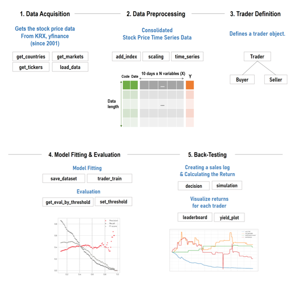

# Summary

 Stock price big data is data that records changes in prices of thousands of stocks over a long period of time, and is time series big data in the financial sector that has important value as a study. Study that used machine learning on historical stock data for technological analysis of pattern-based stock prediction to generate prediction prediction. [@es] As a study of stock price prediction on the following day, stock price data is actively analyzedThe use of machine learning techniques in combination with technical analysis indicators is receiving more and more attention [@es1]. To facilitate this technical analysis, we present the Python integration package "stockAIT" for learning and research. "stockAIT" provides an integrated library that can be performed from one library to machine learning-specific stock time series dataset generation, artificial intelligence modeling and model evaluation, and backtesting. Through this, the goal of this study is to increase the usability and convenience of stock price big data research.

# State of need 

First, "stockAIT" provides the convenience of research on stock price big data. In order to conduct research on stock price data in the traditional way, different libraries are used for each function. For example, "Finance Data Reader", "yfinance"[@yj1], etc., are used for data collection, "NumPy" and "Pandas" are used for data preprocessing, and "scikit-learn"[@yj2],  "TensorFlow", "Pytorch",  and the like are used for modeling. However, with "stockAIT", data collection, preprocessing, modeling, and backtesting can be used in one package, providing ease of study. 
 Second, "stockAIT" provides concise code. Functions such as stock price data collection, data preprocessing such as adding indicators, scaling, trader definition, and yield simulation can be performed in concise code using the functions of "stockAIT". The simplicity of this code makes it easy for people who are not proficient in programming or even financial professionals to conduct research, for maximum efficiency.

# Implementation and use in research 

"stockAIT" is implemented to make stock price big data analysis research easy to use through load_data, add_index, Trader class, etc., and the workflow picture is shown in [Figure 1].
When entering the desired market list in the load_data method, an integrated stock price dataset consisting of Open, High, Low, Close, and Volume by stock (Code) and date is provided. "stockAIT" uses data provided by yfinance for stock price data, while Korea's stock price data crawls public stock price data on the KRX website. As of now, Open, High, Low, Close, Volume data are available from January 1, 2001 to June 30, 2023, and the data is updated annually.
Stock price prediction is a difficult task because it depends on various factors such as political conditions, the global economy, financial reports, and corporate performance [@ej1]. To solve this problem, numerous studies on stock market prediction using technical or basic analysis through various soft computing technologies and algorithms are being conducted [@ej2]. "stockAIT" provides stock price data preprocessing methods specialized in technical analysis.  The add_index method can easily add technical auxiliary indicator columns from Open, High, Low, Close, and Volume of the integrated stock price dataset. In addition, MinMax, Standard, Robust, and DivClose, which standardize price-related variables by dividing them by the closing price of the previous day, are the scaling methods to match different scales for each item. The time_series method reconstructs the daily data to N days before N days (DN-1) compared to the day (D0) and converts it into a time series data set. By performing all three preprocessing, the integrated stock price time series dataset [Figure 2] can be obtained. 

Once the dataset is ready, define the Trader. Model learning and evaluation can be performed on a Trader object basis, and return simulation can be performed through transactions such as buying and selling.
First, train, validation, and test datasets are divided for model learning, and data is stored in the Trader using the save_dataset method. Then, a buyer object and a seller object that enter the Trader object are defined. Buyer's objects include Conditional Buyer, which decides to buy through certain conditions of data, Machine Learning Buyer, which decides to buy on the side of the machine learning model, and Seller's objects include SubSeller objects that sell all purchased stocks the next day.
 In the experiment, the validation dataset used for model evaluation was used from January 1, 2017 to December 31, 2020, the test dataset used for backtesting was used from July 1, 2021 to December 31, 2021, and LightGBM, XGBoost, RandomForest, LSTM, and Transformer models were used. The scikit-learn, xgboost, and lightgbm packages were used to define the model, and the keras framework was used for the deep learning model. Both Keras and PyTorch frameworks are available when defining deep learning models.
 Model learning is conducted with the trader_train function, and after model learning, the performance of the model is confirmed through the get_val_by_threshold function that supports graph [Figure 2] visualization of four evaluation indicators: auc score and precision, recall, and f1 score. For stock trading, you can look at the Precision indicator on the right graph and determine the optimal prediction probability threshold for the section where the model's prediction success rate increases.

If you look at the [Figure 3] graph, and put the thresholds determined in the list in the order of traders and enter them in the lst_threshold factor of the set_threshold function, profitability can be verified with the histogram graph of the closing rate of change [Figure 4] next day. The entered threshold is automatically stored in the machine learning_buyer object for each trader.

[Figure 4] Graph comparing the rate of change at the closing price of the next day based on threshold

The decision function automatically determines the purchase and sale price based on the threshold, and returns it to one DataFrame when all traders are completed. The sales journal DataFrame consists of a purchase (+)/sale (-) status, a purchase/sale ratio, and close information.

The simulation function calculates the rate of return based on the prepared sales log. The leaderboard function has the advantage of knowing the total return by trader, and the yield_plot function supports visualization of the return graph by trading day, allowing you to see the performance of the model immediately. As such, it includes a back-testing process that verifies one's algorithm and investment strategy using historical data.

## References
